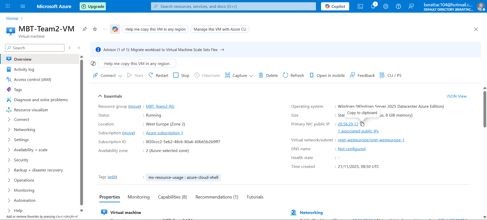
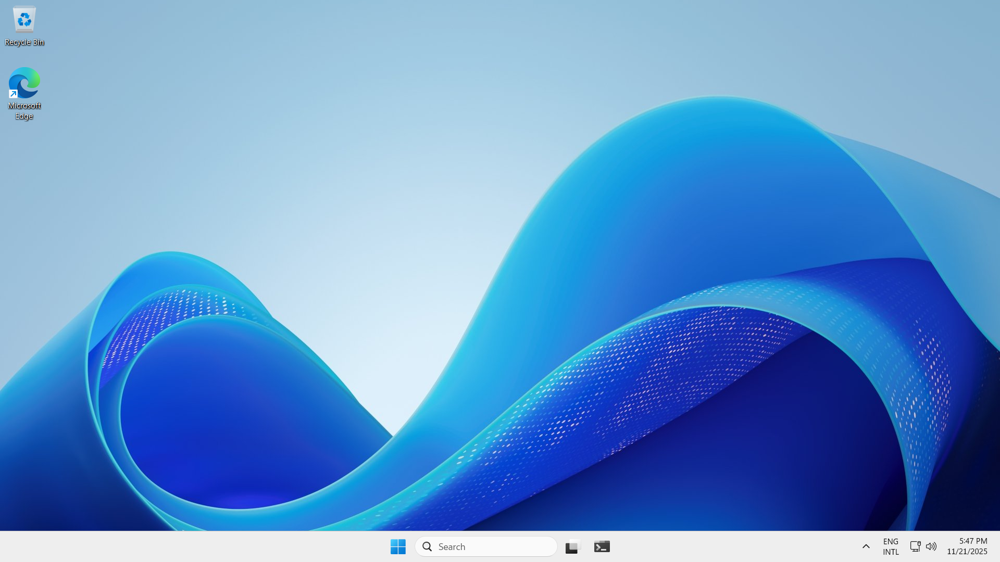
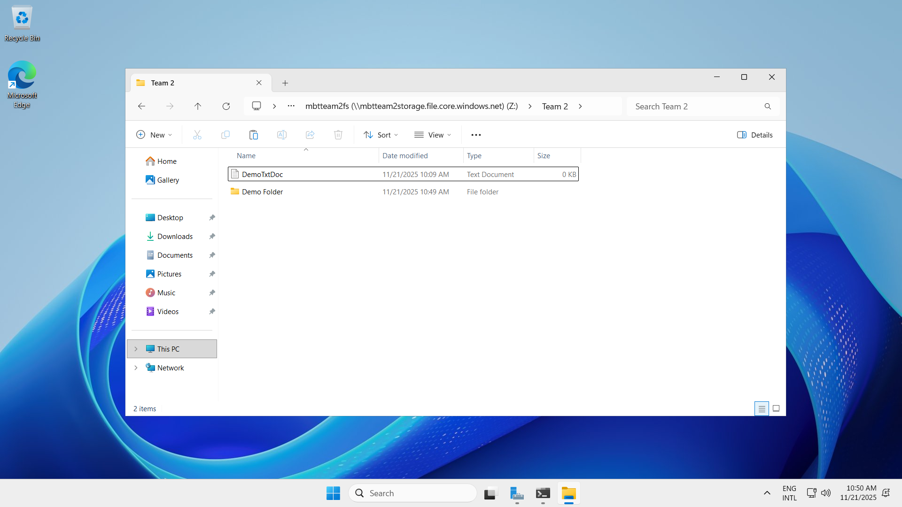
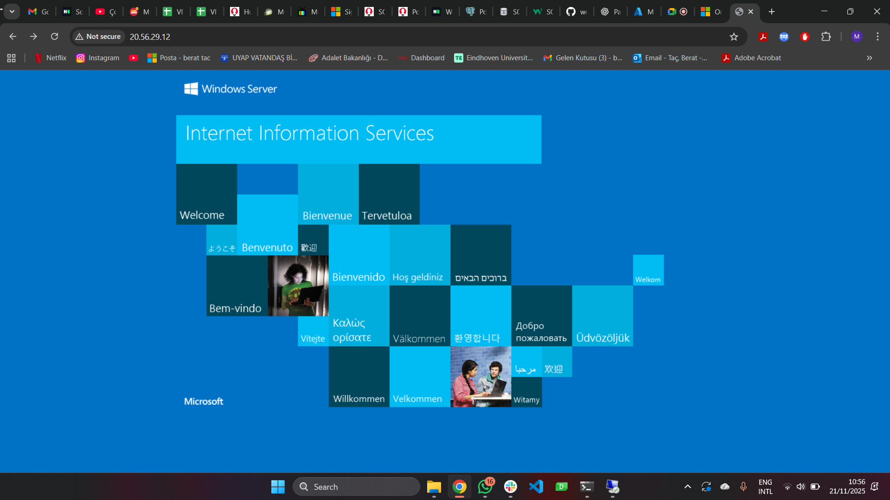
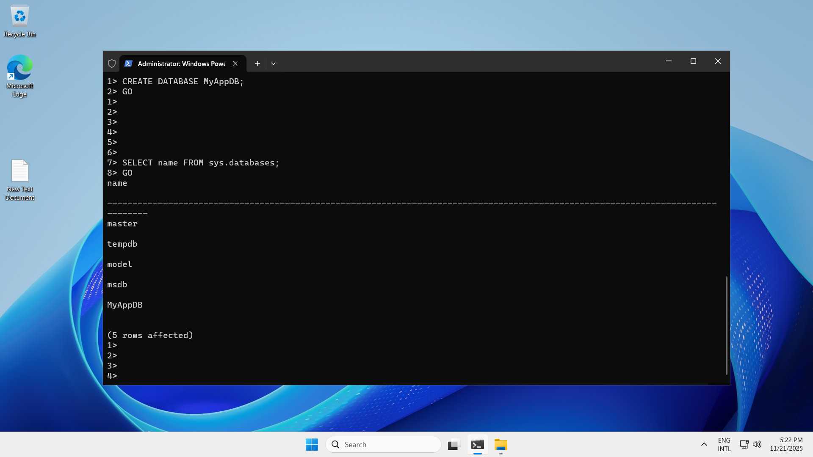
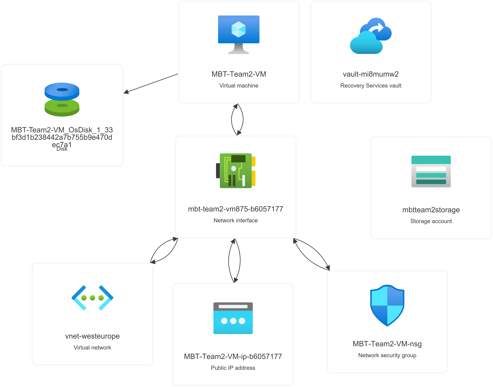
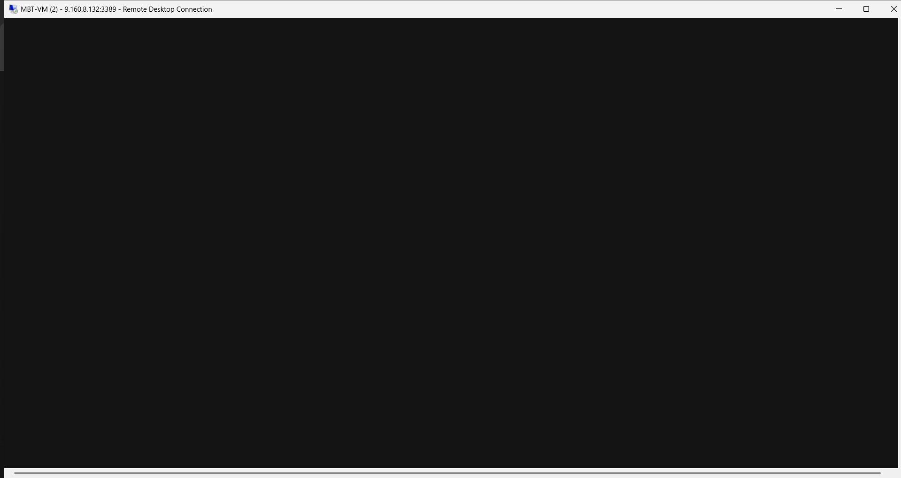

# Azure

Cloud Computing Assignment
Azure VM, IIS Web Server & SQL Server Express Deployment
Student: Mehmet Berat TAC
Course: Cloud Computing / Azure Fundamentals
Date: 21/11/2025

In this assignment, a complete cloud environment was deployed and configured on Microsoft Azure.
A resource group (MBT-Team2-RG) and a Windows Server virtual machine (MBT-Team2-VM) were successfully created.

Several core cloud administration tasks were performed:
The VM was accessed through Remote Desktop Protocol (RDP).

Multiple connection issues (black screen, protocol errors 0x112f / 0x904) were identified and resolved using Azure Serial Console, proving successful troubleshooting skills.
An Azure File Share was created, mounted on the VM, and tested with file operations (create, read, delete).

A fully working default IIS Windows Server website was deployed on the public IP(20.56.29.12).

SQL Server Express 2022 was installed, configured, and a custom database (MyAppDB) was created using SQLCMD.

By completing these tasks, the essential foundations of cloud computing—compute, storage, networking, web hosting, and database management—were all implemented within a single cloud environment.

Challenges Solved;

  RDP Black Screen & Protocol Errors
Encountered black screen on login and repeated disconnections.
Errors: 0x112f, 0x904.

Solved by using Azure Serial Console, restarting RDP services (TermService), and rebooting the VM.
Learned how to fix a VM even when the desktop cannot be accessed.

  SQL Server Silent Installation Issues
Learned correct silent installation parameters.
Fixed SQL Browser service and firewall port settings to enable local connectivity.

  Azure File Share Mounting
Understood how to map Azure File Share to Windows via command line.
Resolved authentication issues using storage account keys.

  IIS Deployment Troubleshooting
Ensured IIS features were enabled correctly.
Verified connectivity via the public IP address.

Learnings

Gained hands-on experience with core Azure services (Resource Groups, Virtual Machines, Storage Accounts, File Shares).
Learned how to troubleshoot VM access issues using Azure Serial Console, a critical real-world Azure management skill.
Learned to install and configure Windows server components using PowerShell & CMD, including IIS and SQL Server Express.
Understood how cloud-based storage works through Azure File Share and how to integrate it with virtual machines.
Practiced creating, deploying, and hosting a website on IIS in a cloud environment.
Learned database creation, SQLCMD usage, and SQL Server instance configuration.
Experienced end-to-end cloud deployment, covering compute, networking, storage, and database layers.

